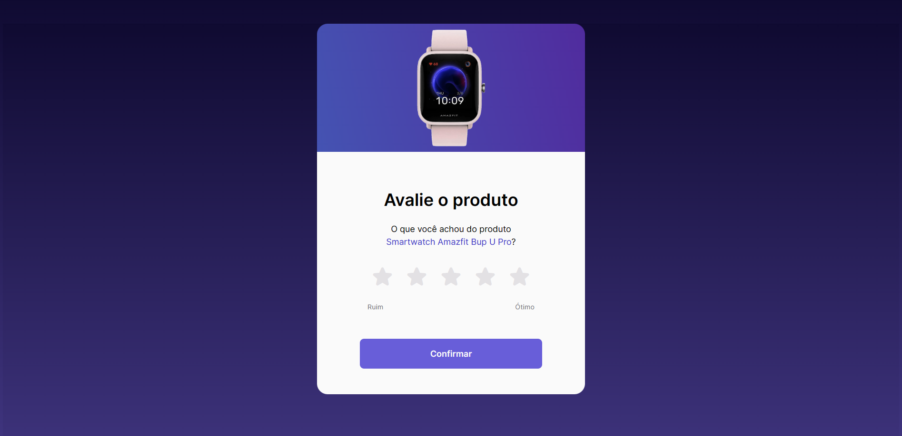
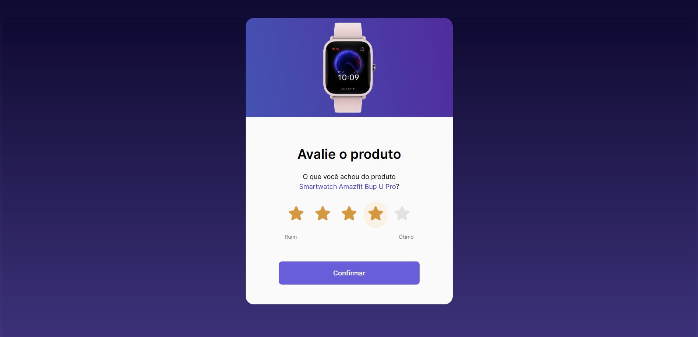
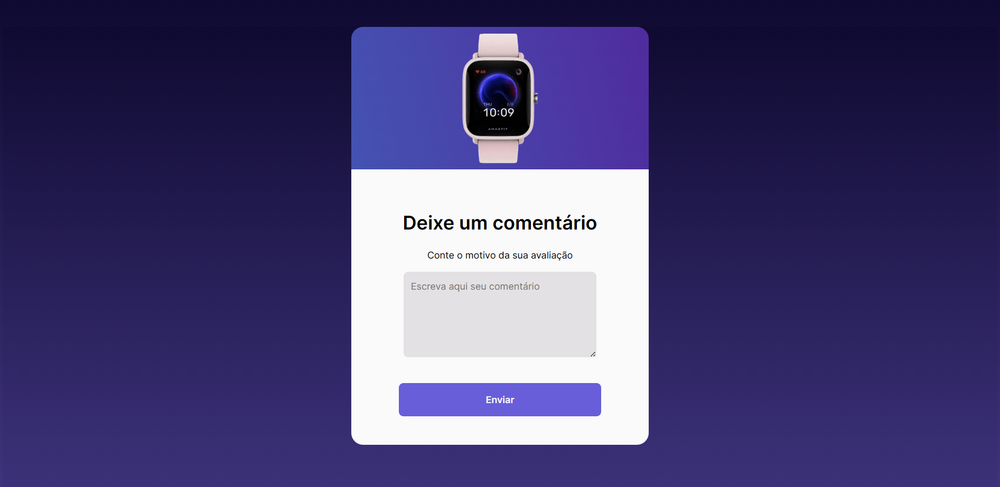
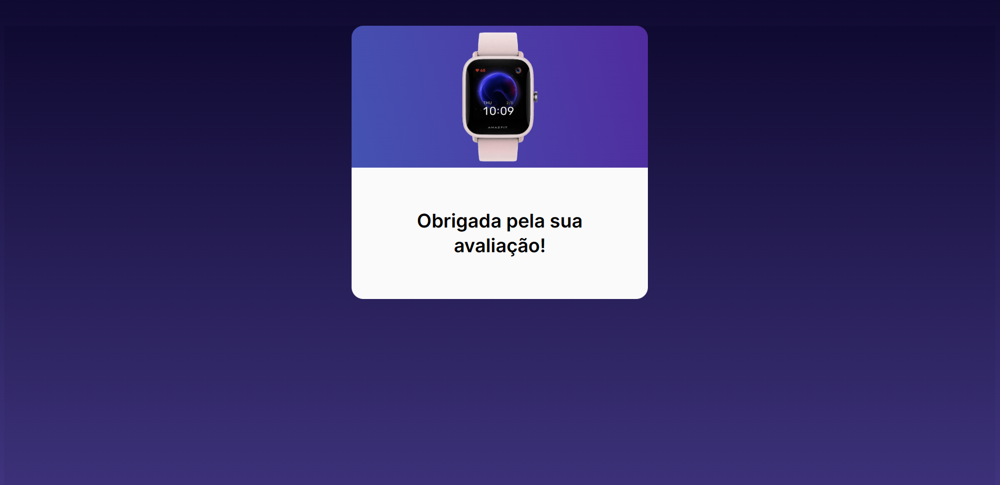

# Widget de Avaliação de Produto

🌟 Bem-vindo ao repositório do Widget de Avaliação de Produto! 🌟

Este projeto é um site que permite aos usuários avaliar o produto com a nota e depois deixar o seu comentário. Ele foi desenvolvido usando tecnologias web padrão, como HTML, CSS e JavaScript.

Este projeto foi desenvolvido como parte de um desafio proposto pelo site [Rocketseat](https://www.rocketseat.com.br/) como parte do programa de desafios semanais.

## Tecnologias Utilizadas

- **HTML:** Utilizamos HTML para estruturar o conteúdo do site e criar a interface do widget.

- **CSS:** O CSS foi utilizado para estilizar o widget e torná-lo atraente e responsivo.

- **JavaScript:** Utilizamos JavaScript para adicionar interatividade ao widget, permitindo aos usuários inserir avaliações de produtos de forma dinâmica.

## Capturas de Tela do Layout

Aqui estão algumas capturas de tela do layout do nosso Widget de Avaliação de Produto:

> Página inicial com o widget de avaliação de produto.

> Página para deixar seu comentário

> Página de agradecimento

